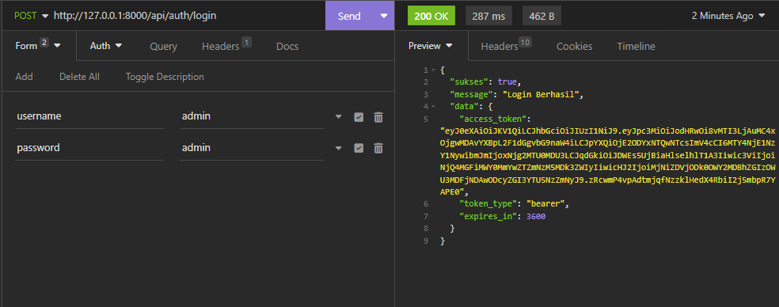

<p align="center"><a href="https://laravel.com" target="_blank"></a></p>

# Test Backend Inosoft

Mulai pengerjaan 5 Juni 2023 - 7 Juni 2023

## Tugas

Membuat api service menggunakan:

-   Laravel 8
-   PHP 8
-   Mongodb 4.2

## Fitur Rest API

1. Lihat stok kendaraan
1. Penjualan kendaraan
1. Laporan penjualan per kendaraan

## Panduan Instalasi

1. Pertama copas file .env.example menjadi file .env atau menggunakan perintah copy, dan update koneksi database
    ```bash
    cp .env.example .env
    ```
1. Kemudian install composer dengan perintah
    ```bash
    composer install
    ```
1. Setelah selesai instalasi semua dependensi, generate key aplikasi
    ```bash
    php artisan key:generate
    ```
1. Generate key JWT, kemungkinan butuh override ketik `yes` kemudian tekan enter
    ```bash
    php artisan jwt:secret
    ```
1. Seed db, untuk data awal dicoba-coba dan login user `user: admin, pass: admin`
    ```bash
    php artisan db:seed
    ```
1. Start server dengan
    ```bash
    php artisan serve
    ```

## URL API

### Autentikasi

-   POST `/api/auth/login` - URL login user default `user:admin , pass: admin`. Dari sini nanti akan mendapat token JWT yang nantinya digunakan untuk berinteraksi dengan API, karena sudah dilindungi dengan autentikasi dengan bearer token
    -   Contoh request
        

### CRUD Kendaraan

-   GET `/api/kendaraan`
    -   Endpoint untuk melihat semua kendaraan
    -   
-   POST `/api/kendaraan`
    -   Endpoint untuk menambahkan kendaraan baik motor maupun mobil, parameter yang diterima berupa form url encoded, seperti `tahun_keluaran(number), warna(string), harga(number), mesin(string), tipe_suspensi(string), tipe_transmisi(string), jenis(motor|mobil), dan stok(number)`.
    -   
    -   
-   PUT `/api/kendaraan/{id}`
    -   Endpoint untuk mengupdate parameter yang ada beberapa atau semuanya dengan passing id di URL.
    -   
-   DELETE `/api/kendaraan/{id}`
    -   Endpoint untuk menghapus data kendaraan dengan passing id di URL
    -   

### Penjualan

-   GET `/api/penjualan`
    -   Melihat data penjualan yang sudah ada
    -   
-   POST `/api/penjualan`
    -   Membuat data penjualan dengan inputkan data `id_kendaraan(string), nama_pelanggan(string), jumlah_pembelian(number)
    -   Ketika data ini di buat stok di kendaraan yang berkaitan akan di kurangi
    -   
-   GET `/api/penjualan/reports`
    -   Melihat laporan penjualan setiap kendaraan, ada data kendaraan, stok, berapa kendaraan yang terjual, dan data penjualannya
    -   

## License

The Laravel framework is open-sourced software licensed under the [MIT license](https://opensource.org/licenses/MIT).
